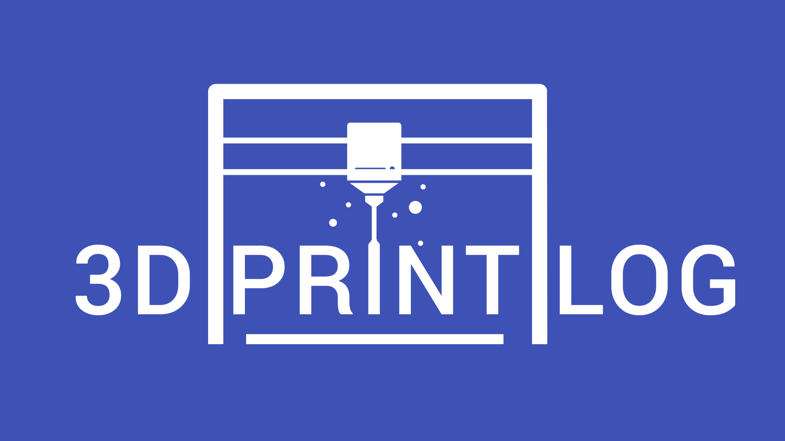

  

# 3D Print Log API

The backend API powering [3D Print Log](https://3dprintlog.com) — a web application for tracking 3D prints, printers, and filaments. Running in production at [api.3dprintlog.com/swagger](https://api.3dprintlog.com/swagger/index.html).

## Features

- **Prints** — log print jobs with duration, material usage, quality ratings, and images
- **Printers** — manage your printer inventory with per-printer statistics
- **Filaments** — track filament stock, usage, and costs
- **Projects** — group related prints together with project-level image galleries
- **Slicer integration** — import print settings directly from Cura, OrcaSlicer, PrusaSlicer, and Bambu Studio
- **Printer webhooks** — automatic print logging via OctoPrint and Klipper/Moonraker integrations
- **Electricity cost tracking** — record wattage per printer and calculate per-print power costs
- **Dual authentication** — Auth0 JWT Bearer for the web app and API key (`X-Api-Key` header) for integrations
- **Image uploads** — per-print and per-project image storage via Azure Blob Storage

## API Documentation

Explore the live API: [api.3dprintlog.com/swagger](https://api.3dprintlog.com/swagger/index.html)

## Getting Started

See [CONTRIBUTING.md](CONTRIBUTING.md) for local setup, configuration, and running tests.

The frontend lives at [HoffmanEngineering/3d-print-log-ui](https://github.com/HoffmanEngineering/3d-print-log-ui). Most feature work requires both running locally.

## Tech Stack

- ASP.NET Core (.NET 10)
- Entity Framework Core + SQL Server
- Auth0 (JWT Bearer authentication)
- Azure Blob Storage (file storage)
- Stripe (subscription billing)

## Infrastructure

The production environment runs on Azure (App Service, SQL Server, Blob Storage). Infrastructure is manually managed — there is no Terraform or IaC setup.

If your contribution requires infrastructure changes (new environment variables, Azure resource configuration, etc.), call this out explicitly in your PR description so the maintainer can coordinate the changes before the code ships.

## Support Development

If you find 3D Print Log useful, consider supporting its development:

- [**Subscribe to Pro**](https://3dprintlog.com/subscription) for an ad-free experience and extra cloud storage
- [**Donate via PayPal**](https://paypal.me/hoffmanengineering) to buy me a coffee
- [**Become a Patron**](https://www.patreon.com/HoffmanEngineering) on Patreon

## License

[GNU Affero General Public License v3.0](LICENSE)
